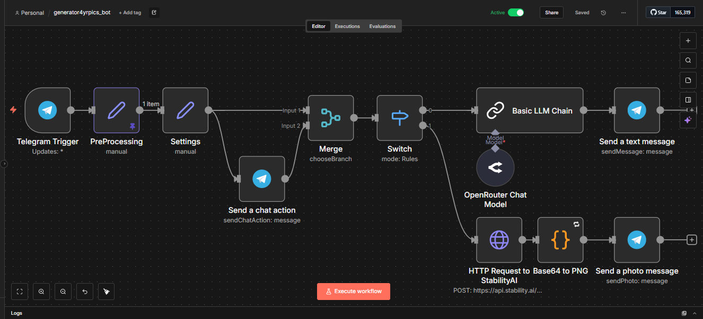
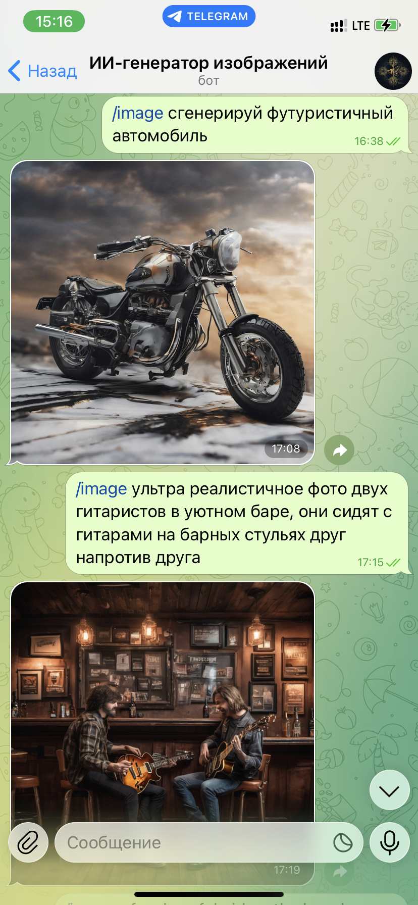
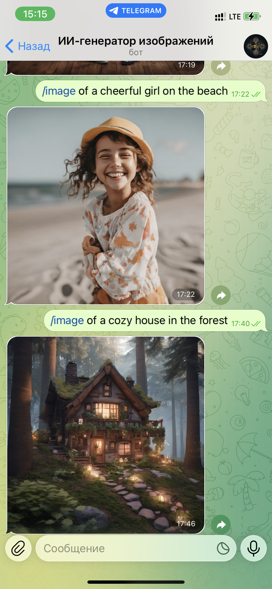
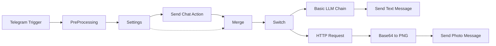

<div align="center">

# 🎨 Telegram AI Image Generator Bot

[](https://n8n.io/)

**Telegram-бот с поддержкой AI: отвечает на сообщения через LLM (OpenRouter) и генерирует изображения по запросу (Stability AI)**

</div>

---

## 📋 Описание

Бот выполняет две основные функции:

1. **AI-чат** — отвечает на сообщения, используя ChatGPT через OpenRouter API. Поддерживает множество языков и учитывает языковые предпочтения пользователя.

2. **Генерация изображений** — создаёт изображения по текстовому описанию с помощью Stable Diffusion XL от Stability AI.

### Ключевые команды

| Команда | Описание |
|---------|----------|
| `/start` | Запуск бота и приветствие |
| `/image <описание>` | Генерация изображения по описанию |

---

## 🛠 Технологии

- **n8n** — платформа автоматизации
- **Telegram Bot API** — взаимодействие с Telegram
- **OpenRouter** — API для доступа к LLM (ChatGPT)
- **Stability AI** — генерация изображений (Stable Diffusion XL)

---

## 📦 Установка

### 1. Клонируйте репозиторий

```bash
git clone https://github.com/your-username/generator4yrpics_bot.git
cd generator4yrpics_bot
```

### 2. Настройте переменные окружения

```bash
cp .env.example .env
# Отредактируйте .env и добавьте ваши API-ключи
```

### 3. Импортируйте workflow в n8n

1. Откройте ваш n8n instance
2. Перейдите в Settings → Import
3. Загрузите файл workflow.json
4. Создайте credentials в n8n:
   - Telegram API — для Telegram
   - OpenRouter API — для OpenRouter
   - Bearer Auth — для Stability AI

### 4. Настройте Webhook

После импорта workflow:
- Скопируйте webhook URL из узла Telegram Trigger
- Настройте webhook в BotFather: /setwebhook

---

## 📁 Структура проекта
```
generator4yrpics_bot/
├── .gitignore           # Исключение чувствительных файлов
├── .env.example         # Шаблон переменных окружения
├── README.md            # Документация
├── workflow.json        # n8n workflow
└── docs/
    └── images/          # Скриншоты и медиа
```

---

## 📸 Скриншоты

### Workflow в n8n



### Пример генерации изображений





---

## 🔧 Workflow Overview



---

## 🤝 Contributing

1. Forkните репозиторий
2. Создайте ветку (git checkout -b feature/amazing-feature)
3. Commitните изменения (git commit -m 'Add amazing feature')
4. Pushните в ветку (git push origin feature/amazing-feature)
5. Откройте Pull Request

---

## 📄 Лицензия

MIT License

---

## 🙏 Благодарности
- [n8n](https://n8n.io/) — за мощную платформу автоматизации
- [OpenRouter](https://openrouter.ai/) — за доступ к LLM
- [Stability AI](https://stability.ai/) — за генерацию изображений

---

## 🎯 Заключение

Данный проект демонстрирует эффективное применение современных AI-технологий для создания функционального Telegram-бота. Благодаря использованию платформы **n8n**, разработка и поддержка workflow становится доступной даже для пользователей без глубоких технических знаний в программировании.

**Ключевые преимущества проекта**

- **Простота развёртывания** — минимальная настройка и быстрый старт
- **Масштабируемость** — легкое добавление новых функций через визуальный редактор n8n
- **Мультимодальность** — поддержка текстовых и графических AI-запросов
- **Кроссплатформенность** — работа с любыми API через HTTP-запросы

**Перспективы развития**

- Добавление потоковой генерации изображений (Stream API)
- Интеграция с дополнительными LLM (Claude, Gemini)
- Поддержка режима диалога с контекстом памяти
- Многоязычная поддержка с автоопределением языка
- Система модерации и фильтрации контента

### *Проект является отличной отправной точкой для создания более сложных AI-ассистентов и может быть легко адаптирован под различные бизнес-задачи.*

---

## 📞 Контакты

**Автор**: Ivan P  
**Telegram**: [@nonoyessure](https://t.me/nonoyessure)

---

<div align="center">

Сделано в **n8️⃣n**

</div>
